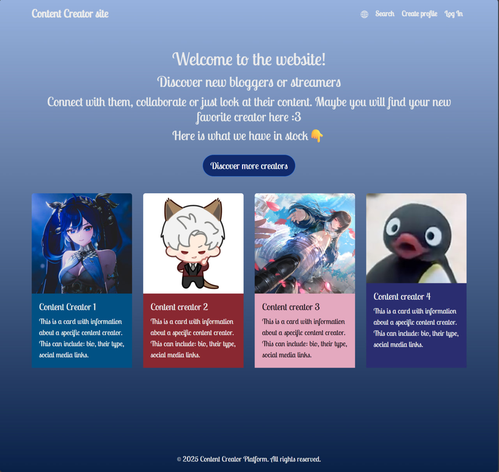
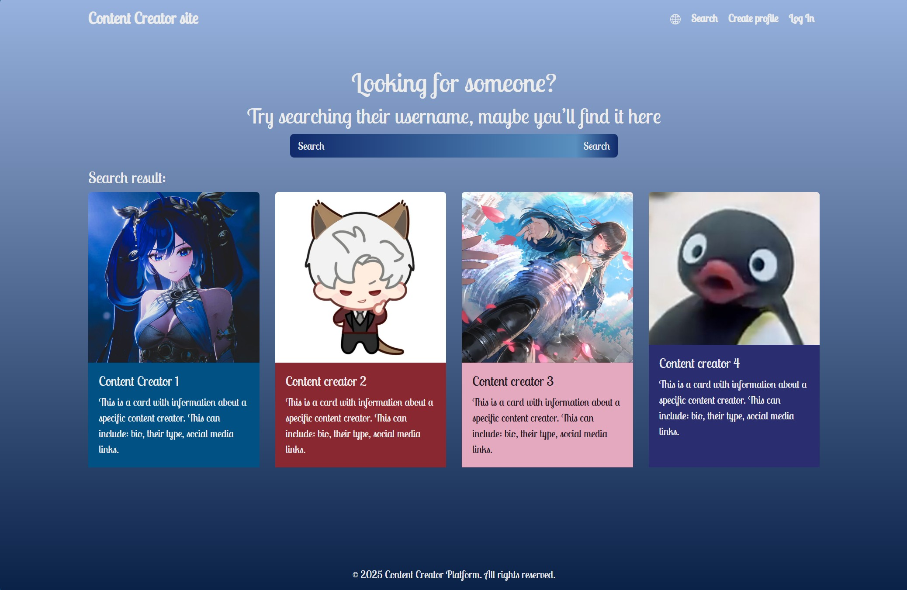
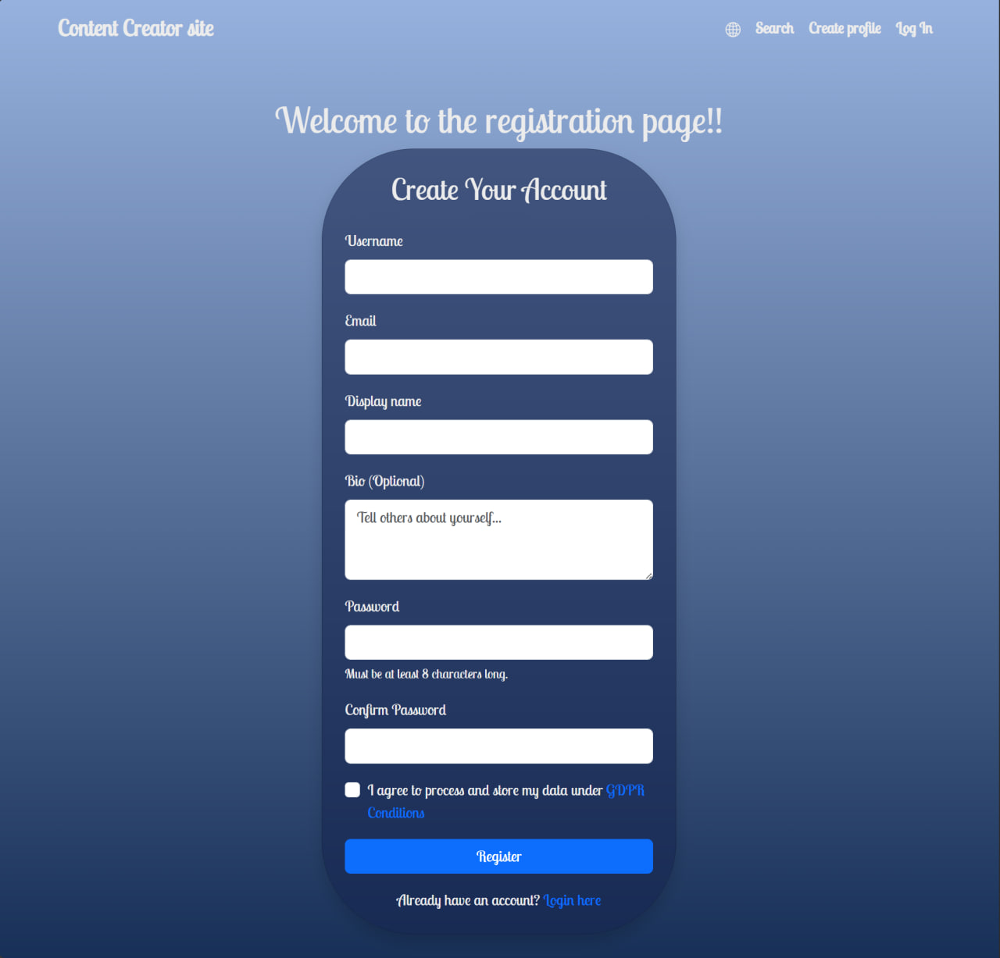
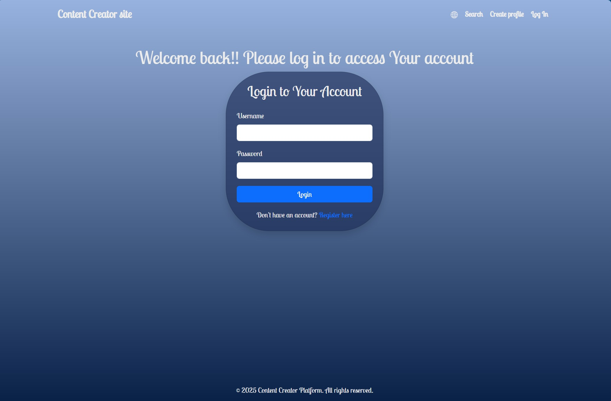
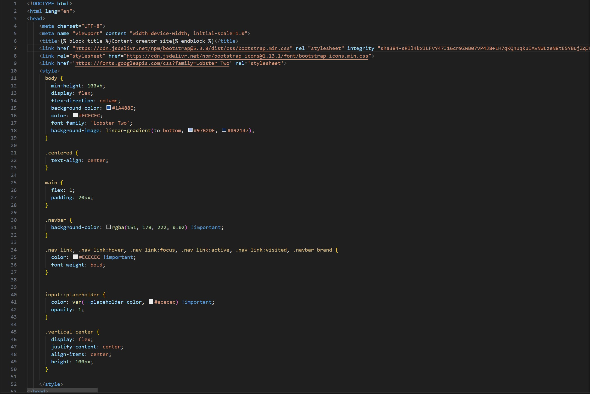

# Content Creator Platform - Project Documentation

## 📋 Project Overview

The Content Creator Platform is a web-based application designed to help users discover, connect with, and collaborate with content creators (bloggers, streamers, etc.). The platform allows creators to showcase their profiles while enabling users to find and interact with them.

## 🏗️ Project Structure

### Backend Technology Stack:
- **Flask** - Python web framework for server-side logic
- **Jinja2** - Templating engine for dynamic HTML generation
- **SQLAlchemy** (implied) - Database ORM for user data management
- **WTForms** (implied) - Form handling and validation

### Frontend Technology Stack:
- **HTML5** - Markup structure
- **CSS3** - Styling with custom and Bootstrap styles
- **Bootstrap 5** - Responsive CSS framework
- **JavaScript** - Interactive functionality
- **Font Awesome/Bootstrap Icons** - Icon library

### File Structure:
```
templates/
├── base.html           # Base template with navigation and common elements
├── index.html          # Home page with creator showcase
├── search.html         # Search functionality page
├── register.html       # User registration page
├── login.html          # User login page
├── dashboard.html      # User profile management page
static/
└── images/            # Static image assets
```

## 🖼️ Screenshots and Requirements Coverage

### 1. **Home Page** (`index.html`)

**Covered Requirements:**
- Display featured content creators
- Provide navigation to search functionality
- Showcase platform purpose and value proposition
- Responsive grid layout for creator cards

### 2. **Search Page** (`search.html`)

**Covered Requirements:**
- Search functionality interface
- Display search results in card format
- Consistent design with home page
- Gradient search input styling

### 3. **Registration Page** (`register.html`)

**Covered Requirements:**
- User account creation with validation
- GDPR compliance acknowledgment
- Password confirmation and strength requirements
- Link to login for existing users

### 4. **Login Page** (`login.html`)

**Covered Requirements:**
- Secure user authentication interface
- Error message display capability
- Link to registration for new users
- Consistent styling with registration page

### 5. **User Dashboard** (`dashboard.html`)
![Dashboard Page] (in progress)
**Covered Requirements:**
- Profile management with banner and avatar
- Social media link management
- Profile editing capabilities
- Modal-based editing interfaces
- Profile statistics display

### 6. **Base Template** (`base.html`)

**Covered Requirements:**
- Consistent navigation across all pages
- Responsive mobile navigation
- Flash message display system
- Unified footer and branding
- Global styling and theming

## 🎨 Human-Computer Interaction Principles Evaluation

### ✅ **Strengths:**

1. **Consistency & Standards**
   - Uniform navigation across all pages
   - Consistent button styles and color scheme
   - Standard form layouts throughout the application

2. **Visibility of System Status**
   - Active navigation highlighting
   - Flash messages for user feedback
   - Loading indicators (implied through JavaScript)

3. **Aesthetic & Minimalist Design**
   - Clean gradient background
   - Well-spaced card layouts
   - Limited color palette for visual harmony

4. **Flexibility & Efficiency of Use**
   - Quick access to search from home page
   - Modal-based editing reduces page reloads
   - Social media link management inline

5. **Error Prevention**
   - Password confirmation field
   - Required field indicators
   - Form validation (implied)

### ⚠️ **Areas for Improvement:**

1. **Accessibility Issues**
   - Low color contrast in some areas (light text on light backgrounds)
   - Missing alt text for functional icons
   - No ARIA labels for interactive elements

2. **Mobile Responsiveness**
   - Profile picture size (500px) may not scale well on mobile
   - Banner edit button positioning could overlap content on small screens
   - Complex modal forms may be cramped on mobile devices

3. **User Control & Freedom**
   - No "Cancel" button in some modal forms
   - Limited undo/back options for profile changes
   - No confirmation dialogs for deletions

4. **Recognition Rather Than Recall**
   - Platform selection in social links requires remembering exact names
   - No preview for banner/image URLs before saving
   - Password requirements only shown during registration

5. **Feedback Systems**
   - No immediate validation feedback for forms
   - Limited success confirmation after actions
   - No loading states for image uploads/URL changes

## 📊 Critical Analysis

### Technical Implementation:
1. **Positive Aspects:**
   - Modular template inheritance reduces code duplication
   - Consistent use of Bootstrap components
   - Separation of concerns between templates
   - Well-structured CSS with clear organization

2. **Technical Concerns:**
   - Inline styles mixed with external CSS (maintainability issue)
   - Large profile images (500px) could impact performance
   - No visible JavaScript error handling
   - Database interactions implied but not shown in templates

### Usability Assessment:
1. **Effective Patterns:**
   - Card-based layout for content discovery
   - Progressive disclosure in profile editing
   - Clear information hierarchy in dashboard
   - Intuitive navigation flow

2. **Usability Gaps:**
   - No search functionality implementation visible in frontend
   - Missing pagination for content lists
   - No sorting/filtering options for creators
   - Limited social proof elements (likes, followers, ratings)

## 🎯 Conclusion

### Summary of Achievements:
The Content Creator Platform successfully implements a comprehensive web application with:
- **Complete user lifecycle** (registration, login, profile management)
- **Creator discovery system** with visual showcase
- **Profile customization** with banner and social links
- **Responsive design** using modern web technologies
- **Consistent visual identity** throughout the application

### Key Strengths:
1. **Visual Appeal**: Attractive gradient design and color scheme
2. **Functionality Coverage**: All essential features for a creator platform
3. **Code Organization**: Well-structured templates with inheritance
4. **User Experience**: Intuitive navigation and clear information architecture

### Recommendations for Enhancement:

1. **Immediate Improvements:**
   - Add alt text to all images for accessibility
   - Implement proper form validation feedback
   - Add loading states for all asynchronous operations
   - Improve mobile responsiveness of profile components

2. **Medium-term Enhancements:**
   - Implement actual search functionality
   - Add user ratings/reviews system
   - Include content categorization/tagging
   - Add messaging/communication features

3. **Long-term Development:**
   - Implement real-time notifications
   - Add analytics dashboard for creators
   - Develop content scheduling features
   - Create collaboration/matchmaking algorithms

### Final Assessment:
The project demonstrates solid understanding of web development fundamentals and creates a functional foundation for a content creator platform. With attention to accessibility, mobile optimization, and enhanced interactive features, this could evolve into a production-ready application. The balance between aesthetic design and functional requirements is well-maintained, though there is room for improvement in user feedback systems and interactive elements.

Original design: https://www.figma.com/design/JxRiYrmIRaQKI4Zr2TK53x/HCI-project?node-id=0-1&t=N9MtgdQ6xyWuI7PY-1 

